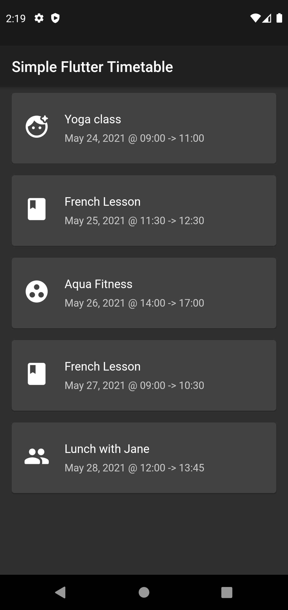

# Simple Flutter Timetable

Simple Flutter App to read a list of appointments from a local JSON file and show them in a list. Useful to understand some concepts that can be used in Flutter Apps like:

- read a file from the local storage
- parse JSON file
- model a JSON file to a list of Dart Classes
- create a list with a FutureBuilder

The final result is 

This app is built with [Flutter](https://flutter.dev/) 2.2, with Sound Null Safety, and works out of the box on:

:white_check_mark: Android
:white_check_mark: iOS
:white_check_mark: Web

You can find the full article on: [Create a Simple Timetable App with JSON & Flutter](https://blog.albertobonacina.com/create-a-simple-timetable-app-with-json-and-flutter)

### License

Distributed under the MIT License. See `LICENSE` for more information.